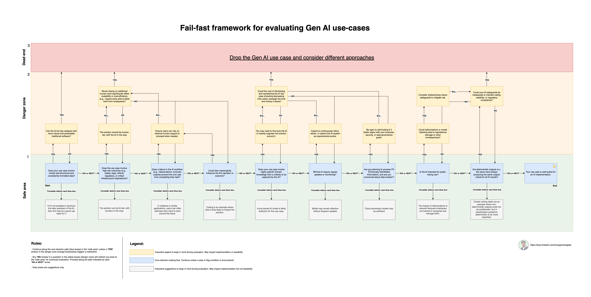

# Gen AI Evaluation Framework

A practical **fail-fast evaluation framework** to help teams quickly evaluate the feasibility, risks, and suitability of Gen AI use cases.

This framework helps you evaluate Gen AI use cases by asking key questions related to:

- How structured and reliable your input data is
- How risky or sensitive the use case might be
- What happens if the AI gets it wrong
- Whether bias could cause harm
- If the AI needs domain-specific knowledge
- How often the system needs updates or retraining
- Whether you're handling personal data or serving public users
- If the outputs need to be consistent and predictable

Whether you're a **product manager**, **engineer**, **designer**, or exploring Gen AI from any angle, this tool is meant to help you make smarter, faster calls on where AI should and shouldn’t be used.

---

## 🔍 Why Use This?

- **Fail fast**: Drop weak AI ideas early and save time.
- **De-risk early**: Identify legal, reputational, or technical challenges before they scale.
- **Standardise evaluation**: Make consistent decisions across your org or product teams.
- **Improve what survives**: Use the framework to strengthen promising use cases.

---

## 🧩 Visual Framework

It walks through a branching logic of yes/no decisions, dividing use cases into:

- ✅ **Safe area**: Proceed with implementation
- ⚠️ **Danger zone**: Caution—additional safeguards or rethinking required
- 🛑 **Dead end**: Consider dropping the use case

---

## 🚧 What’s Next?

This is just the first step. Existing/upcoming flows will include:

- [ ] Add links to help with suggestions and definitions
- [ ] Add more evaluation charts for different use cases:
    - training
    - fine-tuning
    - development
    - deployment
    - monitoring

Stay tuned or contribute your own ideas!

---

## 📬 Contribute

Ideas, improvements, or forks are very welcome.  
Feel free to open issues or submit PRs — let’s make responsible Gen AI easier and more actionable for everyone.

---

## 📎 License

MIT License. Free to use, adapt, and share — but if you find it useful, please credit or tag me when sharing publicly.

---

## 📎 Author

Created by [Eugenio Segala](https://www.linkedin.com/in/eugeniosegala/)
